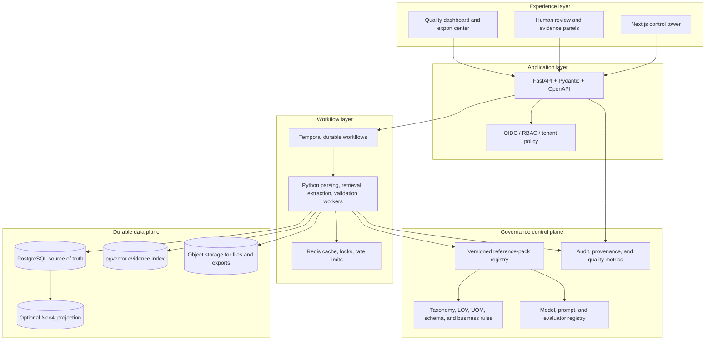

# ForgeGraph

**Evidence-backed product truth for industrial commerce.**

ForgeGraph is a ForgeGraph-only solution for UniHack 2026’s **AI-Powered Product Intelligence for Industrial Commerce** challenge. It converts sparse supplier spreadsheets and technical documents into structured, validated, explainable, and commerce-ready product intelligence without allowing unsupported AI-generated specifications to reach publication.

> **The model proposes claims. The quality firewall decides what can be published.**

## Technology stack

The stack deliberately separates the polished operator experience, the Python intelligence core, and the durable production data plane.

| Layer | Current vertical slice | Proposed production implementation |
|---|---|---|
| Web application | Next.js 14, React 18, TypeScript | Next.js, React, TypeScript, Tailwind CSS, accessible component system |
| API | Python, FastAPI, Pydantic v2, OpenAPI | Versioned FastAPI services with tenant-aware authorization and background-job APIs |
| Data processing | pandas, openpyxl, RapidFuzz | Polars/pandas, openpyxl, Pandera, deterministic rule engine |
| AI orchestration | Structured service boundary prepared for controlled AI | LangGraph subgraphs for classification, extraction, verification, and review assistance |
| Document intelligence | Spreadsheet ingestion | PyMuPDF, Docling/Unstructured, python-docx, OCR for technical PDFs and scans |
| Primary database | In-memory service behind a stable API contract | PostgreSQL with JSONB, relational constraints, audit records, and pgvector |
| Workflow and coordination | Synchronous request-time processing | Temporal workflows, Python workers, Redis for short-lived coordination and caching |
| Evidence and files | Response-level quality metadata | S3-compatible or Google Cloud object storage for raw files, documents, exports, and evidence artifacts |
| Optional graph projection | Claim relationships modeled in the domain contract | Neo4j projection for relationship exploration and conflict investigation when justified |
| Enterprise integration | Not yet required for the competition vertical slice | Java Spring Boot adapters for ERP, PIM, EDI, SAP, webhooks, and scheduled feeds |
| Security and operations | Upload limits, CORS, validation, static checks | OIDC/RBAC, SSRF protection, sandboxed parsing, OpenTelemetry, Prometheus, Grafana, Sentry |
| Delivery | Docker and Vercel deployment | Docker, GitHub Actions, Terraform, environment promotion, rollback, and release gates |

The stack is intentionally pragmatic: **Python is the AI and data core, TypeScript is the control tower, PostgreSQL is the source of truth, and Java is reserved for meaningful enterprise integration boundaries.**

## Problem statement

Industrial manufacturers and commerce teams manage product information across supplier spreadsheets, ERP exports, manufacturer websites, catalogs, specification sheets, installation manuals, technical drawings, images, and PDFs. Those sources are often incomplete, duplicated, inconsistent, abbreviated, or expressed in incompatible units and vocabularies.

The challenge is not merely to generate fluent product descriptions. A wrong voltage, dimension, material, pressure rating, connection type, manufacturer, or compatibility claim can create purchasing errors, returns, support costs, compliance exposure, and loss of trust.

The UniHack challenge asks participants to build an AI-powered system that can create, enrich, and validate product intelligence from limited product information. Its expected outcomes are structured product intelligence, improved quality and consistency, traceable enrichment and validation, and efficient catalog-scale processing.[1]

## Proposed solution: ForgeGraph

ForgeGraph is a governed product-intelligence platform that combines semantic AI with deterministic catalog governance. It treats each important product attribute as an **atomic claim** rather than as free-form generated text.

A ForgeGraph claim contains the original supplier value, normalized value, attribute identity, confidence, source type, evidence reference, transformation history, validation status, rule version, model version, reference-pack version, and review decision. Descriptions are generated only from accepted claims; unsupported values remain unresolved or are routed to review.

The proposed solution has seven stages:

| Stage | What ForgeGraph does | Quality boundary |
|---|---|---|
| **1. Ingest** | Accepts CSV/XLSX, preserves the original file, computes a SHA-256 identity, detects headers, sheets, row counts, encodings, duplicates, and malformed rows. | The original artifact is immutable and every transformation is traceable. |
| **2. Normalize and resolve** | Cleans placeholders, normalizes whitespace and punctuation, resolves MPNs, manufacturers, and brands, and ranks candidate matches. | Exact and approved matches can pass automatically; ambiguous matches require review. |
| **3. Classify** | Maps products into the versioned industrial taxonomy and selects category-specific attributes. | The system cannot emit arbitrary categories or attributes outside the reference pack. |
| **4. Retrieve evidence** | Searches approved manufacturer domains and official manufacturer documents, then extracts page-, table-, and span-level evidence. | Marketplace, distributor, and uncontrolled third-party sources are not primary proof. |
| **5. Extract claims** | Uses structured AI only for semantic classification and candidate extraction. | Strict schemas, allowed values, UOM rules, and abstention prevent unsupported claims. |
| **6. Validate and review** | Runs deterministic LOV, UOM, format, completeness, contradiction, confidence, and evidence-policy checks. | The validation firewall, not the model, decides publishability. |
| **7. Publish** | Creates exact versioned XLSX/CSV/API artifacts and exposes quality, provenance, and review information. | Static official output headers remain unchanged for a given reference-pack version. |

### Why ForgeGraph stands out

ForgeGraph is not an unconstrained chatbot, a marketplace scraper, or a generic product-description generator. Its differentiation is the combination of industrial evidence retrieval, claim-level provenance, versioned reference packs, deterministic governance, contradiction handling, calibrated confidence, and explicit abstention.

The platform is designed to automate the low-risk majority of catalog work while sending uncertain, conflicting, or high-risk decisions to the right human reviewer. This makes the system more defensible than a workflow that optimizes only for fluent output.

## System architecture

The production design separates the user experience, API, workflow execution, data plane, and governance control plane.



### Data plane

The data plane stores source files, raw rows, canonical product identity, claims, evidence, validation results, review tasks, and output artifacts. PostgreSQL is the transactional source of truth. Object storage retains large immutable files and exports. pgvector supports semantic evidence retrieval, while an optional graph projection supports relationship exploration rather than replacing transactional storage.

### Control plane

The control plane versions the reference pack, expected output schema, taxonomy, attribute definitions, LOVs, UOMs, prompts, model versions, validation rules, tenant policies, and evaluation results. Separating these controls from product data prevents a silent prompt, model, or vocabulary change from altering published truth without a release decision.

## End-to-end workflow

```mermaid
flowchart LR
    A[Supplier CSV/XLSX] --> B[Immutable upload + SHA-256]
    B --> C[Schema mapping and placeholder cleaning]
    C --> D[MPN / manufacturer / brand resolution]
    D --> E[Taxonomy and category selection]
    E --> F[Manufacturer-source retrieval]
    F --> G[PDF / HTML / table / OCR extraction]
    G --> H[Structured candidate claims]
    H --> I[LOV + UOM + format + rule validation]
    I --> J{Evidence, confidence, and conflict gates}
    J -->|Pass| K[Accepted claims]
    J -->|Uncertain| L[Risk-based human review]
    J -->|Unsupported| M[Abstain or block]
    L --> K
    K --> N[Description generation from accepted claims]
    N --> O[Exact versioned XLSX / CSV / API output]
    K --> P[Claim ledger and provenance]
    M --> P
    L --> P
```



A typical catalog job moves through `created → validated → queued → running → waiting_review → approved → exported`, with explicit `failed` and `cancelled` paths. Activities are designed to be idempotent and resumable so a transient parser, provider, or network failure does not require restarting an entire catalog.

## Claim ledger and evidence model

The claim ledger is the central product-truth mechanism. It makes every important value inspectable and reproducible.

```text
Claim
 ├── product_id
 ├── attribute_id
 ├── raw_value
 ├── normalized_value
 ├── value_type
 ├── source_type / source_id
 ├── evidence_span_id
 ├── extraction_method
 ├── confidence and reason_codes
 ├── status and criticality
 ├── reference_pack_version
 ├── model_version / prompt_version / rule_version
 └── reviewer decision and timestamps
```

Typical claim states are `candidate`, `accepted`, `rejected`, `unresolved`, `conflicting`, `review_required`, `expired`, and `superseded`. A provenance record links source entities, transformations, activities, models, rules, and human actions. This follows the general provenance idea of representing entities, activities, agents, and derivation paths.[2]

### Evidence policy

Evidence retrieval is restricted to approved manufacturer websites and official manufacturer documents. Evidence records include the URL, domain, title, document hash, retrieval time, page or table location, extracted text span, parser version, and source-authority classification. A value without adequate support is not silently converted into a confident technical claim.

## AI and governance design

ForgeGraph uses AI for semantic work and deterministic software for governance.

| AI worker | Responsibility | Non-negotiable control |
|---|---|---|
| Schema worker | Maps supplier columns and detects anomalies. | Cannot alter the official output contract. |
| Identity worker | Ranks MPN, manufacturer, and brand candidates. | Low-confidence or multi-match results go to review. |
| Taxonomy worker | Proposes category and classpath candidates. | Must select from the taxonomy registry. |
| Retrieval worker | Finds manufacturer pages and documents. | Manufacturer-domain allowlist and SSRF protections. |
| Evidence worker | Extracts exact supporting spans. | Sandboxed parsing and source metadata. |
| Extraction worker | Produces structured attribute candidates. | Strict JSON schema, LOV/UOM context, and abstention. |
| Verification worker | Checks claim support and contradictions. | Cannot approve a failed or unsupported claim. |
| Description worker | Writes commerce content from accepted claims. | Cannot introduce new technical facts. |
| Review assistant | Explains uncertainty and alternatives. | Human reviewer remains the decision-maker. |

The core reliability loop is:

1. Validate identity before retrieval.
2. Restrict retrieval to approved manufacturer sources.
3. Parse untrusted content in a sandbox.
4. Rank evidence at the attribute level.
5. Require an exact evidence span for non-trivial technical values.
6. Validate the claim against LOV, UOM, format, and business rules.
7. Detect conflicts across sources.
8. Abstain or route to human review when evidence or confidence is insufficient.

Confidence is calibrated from identity match quality, source authority, evidence entailment, LOV validity, extraction consistency, cross-source agreement, deterministic rule status, ambiguity, and contradiction penalties. It is not treated as an unexplained number emitted by a language model.

## UniHack alignment

The official challenge resources define a strict evaluation mindset: supplier inputs are limited, output structure matters, controlled values and units matter, and reliable enrichment must be traceable.[1]

| Challenge expectation | ForgeGraph response |
|---|---|
| Generate structured product intelligence from limited inputs | Canonical identity, taxonomy, category-aware attributes, claims, and channel-ready content. |
| Improve product-data quality and consistency | Placeholder cleaning, aliases, master-data resolution, LOVs, UOMs, deterministic normalization, and rule validation. |
| Validate and enrich with traceable outputs | Manufacturer-source evidence, claim ledger, provenance, validation results, and review history. |
| Scale across large catalogs | Durable batch workflows, caching, retry/resume behavior, worker isolation, and quality metrics. |
| Preserve the official output contract | Reference-pack registry and immutable schema-aware export pipeline. |

Depth is prioritized over shallow breadth. The recommended initial deep category is **Fittings**, where ForgeGraph can demonstrate connection types, materials, sizes, pressure ratings, UOM normalization, evidence retrieval, contradictions, and category-specific descriptions. Additional categories such as Faucets can be added through new versioned attribute packs rather than hardcoded branches.

## Permanent deployment and live evidence

The current vertical slice is permanently deployed:

- **Website:** [forgegraph-unihack-hack2skill.vercel.app](https://forgegraph-unihack-hack2skill.vercel.app/)
- **API:** [forgegraph-api-root.vercel.app](https://forgegraph-api-root.vercel.app/)
- **Health:** [forgegraph-api-root.vercel.app/health/live](https://forgegraph-api-root.vercel.app/health/live)
- **Repository:** [github.com/SriRamkunamsetty/ForgeGraph-UniHack-Hack2Skill](https://github.com/SriRamkunamsetty/ForgeGraph-UniHack-Hack2Skill)

### Deployment snapshot


### Live UniHack sample run

The attached 1,000-row sample is preserved at [`demo/Unihack_SampleDataset-Input.csv`](demo/Unihack_SampleDataset-Input.csv). The exact response from the permanent API is preserved at [`docs/assets/unihack-sample-job-response.json`](docs/assets/unihack-sample-job-response.json).

| Output metric | Live result |
|---|---:|
| Job status | `waiting_review` |
| Total rows | 1,000 |
| Processed rows | 1,000 |
| Accepted rows | 0 |
| Review-required rows | 1,000 |
| Failed rows | 0 |
| Claims generated | 3,000 |
| Claims with evidence | 0 |
| Validation errors | 0 |
| Evidence coverage | 0% |


The result is intentionally conservative. The development starter reference pack does not contain the sample’s manufacturer master data, and the source marks brand values as unavailable or unbranded. ForgeGraph recognizes the official sample headers `Mfg_Part_Num`, `Part_Desc`, and `Part_Manuf`, processes all 1,000 rows, and routes them to review rather than publishing unsupported manufacturer or brand claims. This is a live vertical-slice governance result, not a benchmark score.

## Current implementation status

The repository now contains the production implementation path as well as the permanent demo. The code includes a PostgreSQL job store and Alembic migration, a Google Cloud Storage artifact adapter, Cloud Tasks dispatch with a protected worker endpoint, versioned reference-pack loading and importing, deterministic quality-firewall rules, exact-schema-aware CSV/XLSX export, SSRF-aware manufacturer evidence retrieval, PDF/HTML text extraction, structured Vertex AI/OpenAI-compatible claim extraction, risk-ranked human review tasks, tenant-scoped audit events, optional OIDC/JWT enforcement, Prometheus-compatible metrics, a polling control tower, review actions, and GCP Terraform plus deployment automation.

The seven-stage workflow is executable through the service boundaries: ingest creates an immutable artifact and job identity; normalization resolves source fields and master data; classification is constrained by a versioned taxonomy; evidence retrieval accepts only approved manufacturer domains; extraction is schema-constrained and can abstain; validation and review enforce publication gates; and CSV/XLSX/API outputs are produced from the active reference-pack contract. Local development continues to default to memory and inline processing so the permanent public demo remains easy to run.

The final operational rollout still requires a real GCP project with billing, authenticated deployment permissions, Cloud SQL and Cloud Storage resources, protected secrets, an approved manufacturer-domain allowlist, the official UniHack reference pack, a reviewed Vertex AI budget/model policy, and end-to-end acceptance tests against the provisioned services. These prerequisites cannot be fabricated or completed from this sandbox because no authenticated GCP project is available here. Use [`infra/gcp/README.md`](infra/gcp/README.md) and [`ci/deploy-gcp.sh`](ci/deploy-gcp.sh) for the controlled rollout.

## API surface

| Method | Endpoint | Purpose |
|---|---|---|
| `GET` | `/health/live` | Liveness check. |
| `GET` | `/health/ready` | Readiness check including PostgreSQL when enabled. |
| `GET` | `/metrics` | Prometheus-compatible application counters. |
| `POST` | `/api/v1/catalog/jobs` | Upload CSV/XLSX and create an inline or Cloud Tasks job. |
| `GET` | `/api/v1/catalog/jobs` | List jobs for the tenant. |
| `GET` | `/api/v1/catalog/jobs/{job_id}` | Retrieve job status and quality summary. |
| `GET` | `/api/v1/catalog/jobs/{job_id}/products` | Inspect normalized products and claims. |
| `GET` | `/api/v1/catalog/jobs/{job_id}/quality-report` | Retrieve the quality report. |
| `GET` | `/api/v1/catalog/jobs/{job_id}/export.csv` | Download a schema-aware CSV export. |
| `GET` | `/api/v1/catalog/jobs/{job_id}/export.xlsx` | Download a schema-aware XLSX export. |
| `POST` | `/api/v1/evidence/fetch` | Fetch allowlisted manufacturer evidence and persist its metadata. |
| `GET` | `/api/v1/evidence/sources` | List tenant-scoped evidence sources. |
| `POST` | `/api/v1/catalog/jobs/{job_id}/extract-claims` | Run strict structured claim extraction from selected evidence. |
| `GET` | `/api/v1/reviews` | List risk-ranked human review tasks. |
| `POST` | `/api/v1/reviews/{task_id}/decision` | Approve or reject a review task and record the decision. |
| `GET` | `/api/v1/audit` | List tenant-scoped audit events. |

## Local development

### Backend

```bash
cp .env.example .env
python3 -m venv .venv
source .venv/bin/activate
pip install -e '.[dev]'
uvicorn forgegraph.main:app --app-dir apps/api/src --reload --port 8080
```

Open [http://localhost:8080/docs](http://localhost:8080/docs) for the OpenAPI interface and [http://localhost:8080/health/live](http://localhost:8080/health/live) for the health check.

### Frontend

```bash
cd apps/web
pnpm install
pnpm dev
```

Set `NEXT_PUBLIC_API_BASE_URL=http://localhost:8080` for local API access, then open [http://localhost:3000](http://localhost:3000).

### Optional local services

```bash
docker compose up -d postgres redis
```

The current vertical slice deliberately keeps the service implementation isolated in memory behind a stable API contract. PostgreSQL, object storage, Redis, and durable workflow services are target production components, not hidden dependencies of the current demo.

## Quality gates

```bash
ruff format --check .
ruff check .
mypy apps/api/src/forgegraph
pytest -q
cd apps/web && pnpm build
```

The test suite covers placeholder normalization, unit/fraction helpers, successful upload/job behavior, and unsupported-extension rejection. The official 1,000-row sample is also checked in for repeatable scale-oriented smoke testing.

## Security and reliability principles

Uploaded files and retrieved documents are untrusted. The production design requires tenant-aware RBAC, signed object URLs, sandboxed parsing, manufacturer-domain allowlists, strict file and token limits, structured model outputs, SSRF protection, prompt-injection isolation, audit events, secret management, dependency scanning, and release gates.

ForgeGraph follows five reliability rules:

1. **Evidence before fluency:** a fluent paragraph is not proof.
2. **Unknown is better than invented:** unsupported values remain unresolved or go to review.
3. **Constraints are data:** schemas, LOVs, UOMs, taxonomy, and rules are versioned registry objects.
4. **Review is risk-based:** humans focus on ambiguity, conflict, and high-criticality fields.
5. **Results are reproducible:** input hash, reference pack, model, prompt, rules, evidence, and review history are retained.

## Production roadmap

| Phase | Outcome |
|---|---|
| **Phase 1 — Reference-pack compiler** | Import the official input/output workbooks, master data, LOVs, UOMs, taxonomy, and content rules as versioned executable contracts. |
| **Phase 2 — Durable data plane** | Replace in-memory jobs with PostgreSQL, object storage, migrations, retention, tenant isolation, and artifact checksums. |
| **Phase 3 — Deep Fittings workflow** | Add category-aware taxonomy, attribute definitions, manufacturer retrieval, document parsing, evidence spans, contradiction checks, and descriptions. |
| **Phase 4 — Human review control tower** | Add review queues, field-level evidence panels, approval/rejection/edit actions, audit history, and reviewer feedback. |
| **Phase 5 — Evaluation and scale** | Run the labelled benchmark, calibration, ablations, load tests, failure injection, quality drift monitoring, and exact output validation. |
| **Phase 6 — Enterprise integration** | Add Java/Spring Boot adapters for ERP, PIM, EDI, scheduled feeds, webhooks, and downstream publication. |

## Team and challenge identity

| Field | Value |
|---|---|
| Team | **Zen Z** |
| Team lead | **Mohan Sriram Kunamsetty** |
| Challenge | **UniHack 2026 — AI-Powered Product Intelligence for Industrial Commerce** |
| Product scope | **ForgeGraph industrial product intelligence only** |

## License

ForgeGraph is released under the [MIT License](LICENSE).

## References

[1]: https://hack2skill.com/event/unilog2026 "Hack2Skill UniHack 2026 challenge page"
[2]: https://www.w3.org/TR/prov-overview/ "W3C PROV-O and provenance overview"
[3]: https://fastapi.tiangolo.com/ "FastAPI documentation"
[4]: https://nextjs.org/docs "Next.js documentation"
[5]: https://docs.pydantic.dev/latest/ "Pydantic documentation"
[6]: https://www.postgresql.org/docs/ "PostgreSQL documentation"
[7]: https://github.com/pgvector/pgvector "pgvector project documentation"
[8]: https://opentelemetry.io/docs/ "OpenTelemetry documentation"
[9]: https://owasp.org/www-community/attacks/Server_Side_Request_Forgery_Prevention_Cheat_Sheet "OWASP SSRF prevention guidance"
