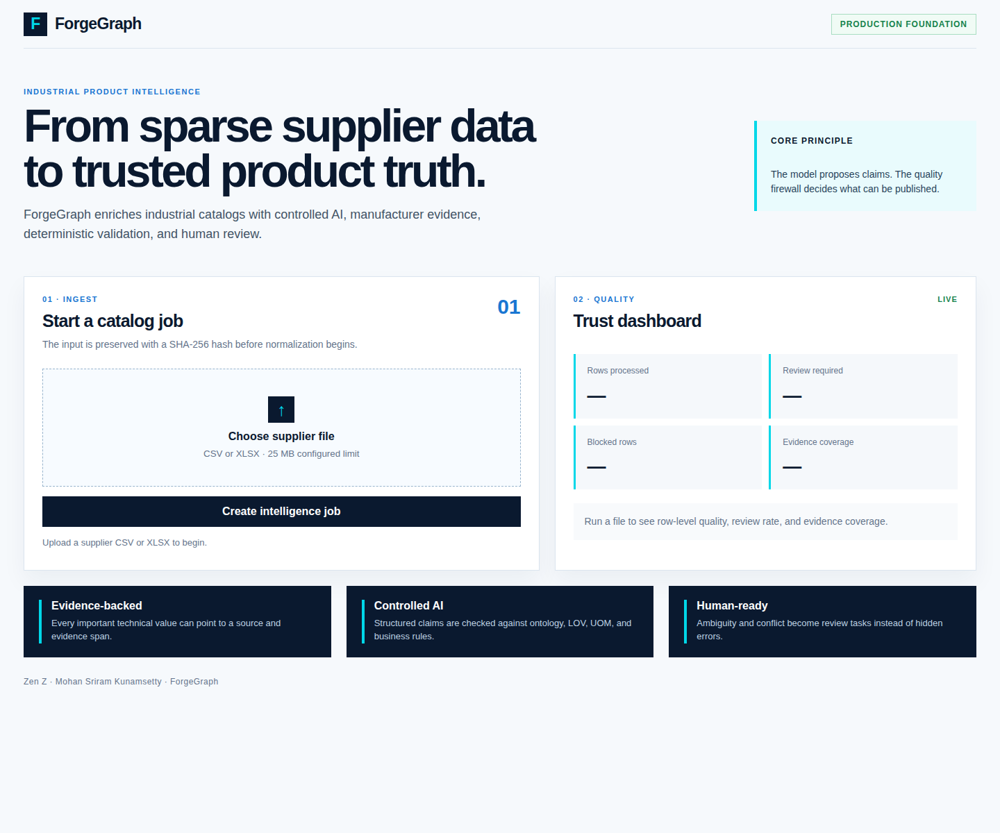
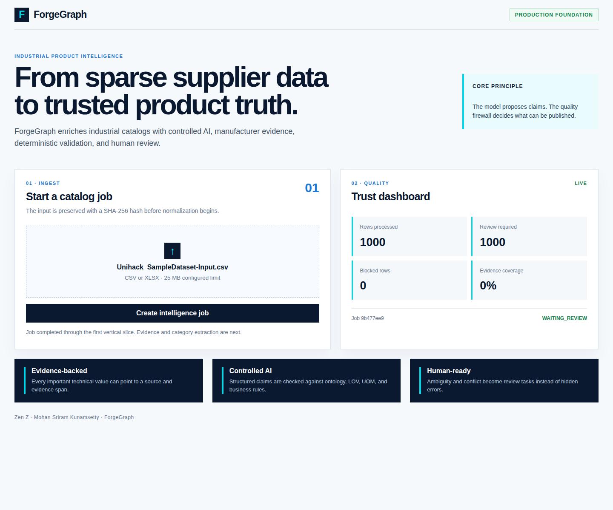

# ForgeGraph

**Evidence-backed product truth for industrial commerce.**

ForgeGraph is the production-grade solution for the UniHack challenge **AI-Powered Product Intelligence for Industrial Commerce**. It transforms sparse supplier spreadsheets and technical documents into structured, validated, explainable, commerce-ready product records.

## Current implementation

The repository currently contains the first end-to-end vertical slice:

- Secure CSV/XLSX upload validation.
- Immutable input SHA-256 hash generation.
- Placeholder and whitespace normalization.
- Manufacturer and brand master-data matching.
- Atomic product claim creation.
- Deterministic validation results.
- Row-level publish/review/blocked status.
- Quality summary and evidence-coverage reporting.
- FastAPI service and an initial Next.js control-tower screen.

The next milestones add the official UniHack reference pack, PostgreSQL persistence, durable workflows, manufacturer-source retrieval, document intelligence, evidence verification, human review, and exact Expected Output export.

## Permanent deployment and live sample evidence

The current ForgeGraph vertical slice is permanently deployed and connected to this repository. Open the live control tower at [forgegraph-unihack-hack2skill.vercel.app](https://forgegraph-unihack-hack2skill.vercel.app/) and the public API at [forgegraph-api-root.vercel.app](https://forgegraph-api-root.vercel.app/). Both services deploy from the `master` branch through Vercel.

### Deployment snapshot



The screenshot above was captured from the permanent public website before a catalog upload. It shows the ForgeGraph ingest workflow, trust dashboard, evidence-backed governance positioning, and the Zen Z team attribution.

### UniHack sample input and live output

The attached 1,000-row UniHack sample is checked in as [`demo/Unihack_SampleDataset-Input.csv`](demo/Unihack_SampleDataset-Input.csv). It was uploaded to the permanent API after adding mappings for the official sample headers (`Mfg_Part_Num`, `Part_Desc`, and `Part_Manuf`) and explicit no-brand placeholders. The raw response is preserved in [`docs/assets/unihack-sample-job-response.json`](docs/assets/unihack-sample-job-response.json).

| Output field | Live result |
|---|---:|
| Job status | `waiting_review` |
| Total rows | 1,000 |
| Processed rows | 1,000 |
| Accepted rows | 0 |
| Review-required rows | 1,000 |
| Failed rows | 0 |
| Claims generated | 3,000 |
| Claims with evidence | 0 |
| Validation errors | 0 |
| Evidence coverage | 0% |



The output snapshot above was captured from the real deployed UI after uploading the sample. The result is intentionally conservative: the starter development reference pack does not contain the sample’s manufacturer master data, and the sample explicitly marks brand fields as unbranded or unavailable. ForgeGraph therefore routes all 1,000 rows to human review rather than publishing unsupported manufacturer or brand claims. This is a governance result, not a benchmark score; the official reference pack, evidence retrieval, and exact Expected Output exporter remain future milestones.

## Product architecture

```text
Next.js control tower
        ↓
FastAPI + OpenAPI + Pydantic
        ↓
Durable catalog workflows
        ↓
PostgreSQL + pgvector + object storage + Redis
        ↓
Entity resolution + taxonomy + manufacturer evidence
        ↓
Structured claims + validation firewall
        ↓
Human review or versioned XLSX/CSV/API publication
```

## Local setup

```bash
cp .env.example .env
python3 -m venv .venv
source .venv/bin/activate
pip install -e '.[dev]'
uvicorn forgegraph.main:app --app-dir apps/api/src --reload --port 8080
```

Open the API documentation at `http://localhost:8080/docs` and the health endpoint at `http://localhost:8080/health/live`.

To run the local PostgreSQL and Redis services:

```bash
docker compose up -d postgres redis
```

The first vertical slice uses an isolated in-memory service behind a stable API contract. PostgreSQL migration work will replace this implementation before production publication.

## Frontend setup

```bash
cd apps/web
pnpm install
pnpm dev
```

Set `NEXT_PUBLIC_API_BASE_URL=http://localhost:8080` for local API access.

## Engineering principles

ForgeGraph separates semantic AI work from deterministic governance. The model proposes structured claims; the validation firewall decides whether those claims are publishable. Unsupported technical values remain unresolved instead of being invented. Every production claim will include provenance, evidence, confidence, rule status, version information, and review history.

## Security principles

Uploaded files and retrieved documents are untrusted. The production system will enforce tenant-aware RBAC, signed object URLs, sandboxed parsing, manufacturer-domain allowlists, strict file and token limits, structured model outputs, SSRF protection, prompt-injection isolation, audit events, secret-manager integration, and release gates.

## Challenge identity

- Team: **Zen Z**
- Team lead: **Mohan Sriram Kunamsetty**
- Challenge: **UniHack 2026 — AI-Powered Product Intelligence for Industrial Commerce**
